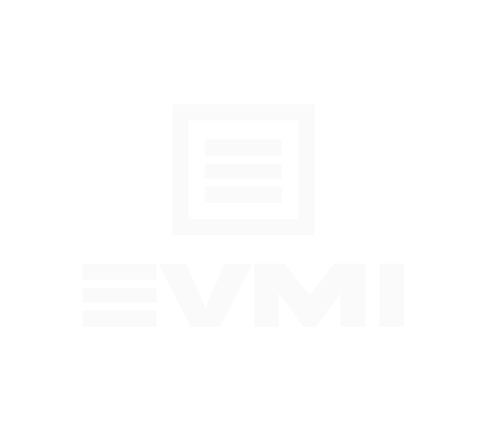

<p align="center">
  
</p>

# EVM Indexer

EVMI is a powerful and flexible Ethereum Virtual Machine (EVM) log indexing service that helps you capture, store, and process blockchain events efficiently.

## Features

- **Multi-Chain Support**: Index logs from any EVM-compatible blockchain
- **Flexible Storage**: Choose between different storage backends
- **Real-time Event Processing**: Stream events to various message brokers
- **Incremental Backups**: Export logs in multiple formats for analytics
- **Configurable Pipeline**: Define custom indexing rules per contract
- **Web UI**: Monitor and manage your indexing pipelines

## Getting Started

EVMI can be used for multiple use cases:
- Smart contract log storage and indexing
- Event streaming to message brokers (Redis PubSub, Kafka, Webhooks)
- Analytics data export (JSON/Parquet formats)

### Installation

```bash
# Using Docker
docker pull evmicloud/go-evm-indexer
docker run -p 8080:8080 evmicloud/go-evm-indexer

# From source
go install github.com/evmi-cloud/go-evm-indexer/cmd/evm-indexer@latest
```

### Configuration

Create a configuration file (e.g., `config.json`):

```json
{
    "storage": {
        "type": "clover",
        "config": {
            "path": "./datastore"
        }
    },
    "indexer": {
        "maxBlockRange": 1000,
        "pullInterval": 2,
        "rpcMaxBatchSize": 1000
    },
    "stores": [
        {
            "identifier": "my-pipeline",
            "description": "Example pipeline",
            "rpc": "https://your-rpc-endpoint",
            "chainId": 1,
            "sources": [
                {
                    "name": "Contract Events",
                    "type": "STATIC",
                    "contracts": [
                        { 
                            "address": "0x...", 
                            "contractName": "MyContract" 
                        }
                    ],
                    "startBlock": 1000000
                }
            ]
        }
    ]
}
```

## Components

### Storage Engines

Available storage backends:
- **Clover** (Default): Embedded document database optimized for log storage
- **FrostDB** (Planned): Column-oriented storage for analytical workloads

### Event Hooks

Supported message brokers:
- **Redis PubSub**: Real-time event streaming
- **Webhooks**: HTTP callbacks for event notifications
- **Kafka** (Planned): Distributed event streaming

### Backup System

Backup configuration options:
- **File Formats**: JSON, Apache Parquet
- **Storage Destinations**: S3, Google Cloud Storage, IPFS

## Web Interface

EVMI includes a web UI for:
- Pipeline management
- Log monitoring

Access the UI at `http://localhost:8080` after starting the service.

## Documentation

For detailed documentation, visit our [documentation site](https://docs.evmi.dev) (coming soon).

## License

MIT License - see LICENSE file for details.
